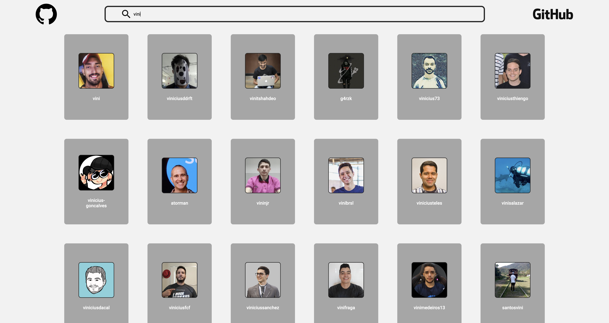
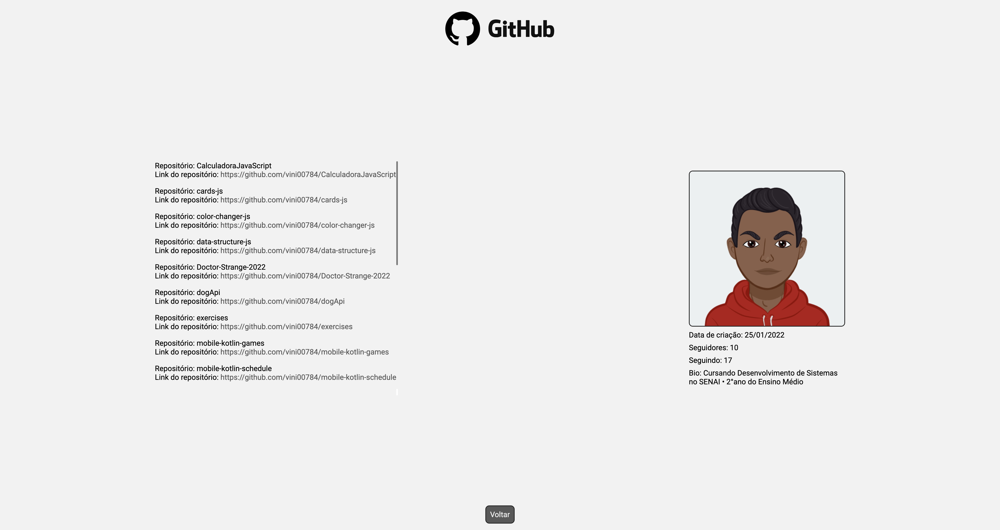
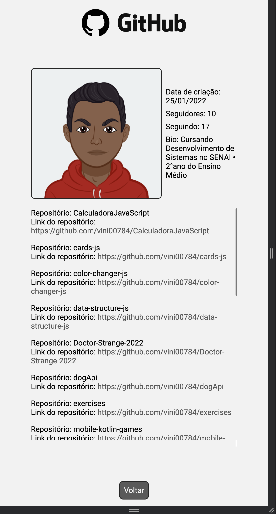

# API GitHub

* Objective: Consume the GitHub API. Having the ability to search for resource users and view certain information

* Used Technologies:
    
    * HTML
    * CSS
    * JavaScript
    * Figma

<a href="https://www.figma.com/file/4msQJfpFATcfBRAHq5IScI/GitHub-Rest-API?node-id=0%3A1">See Design in Figma</a>

---

## DeskTop Images

</img>

</img>

## Mobile Images

</img> </img>
